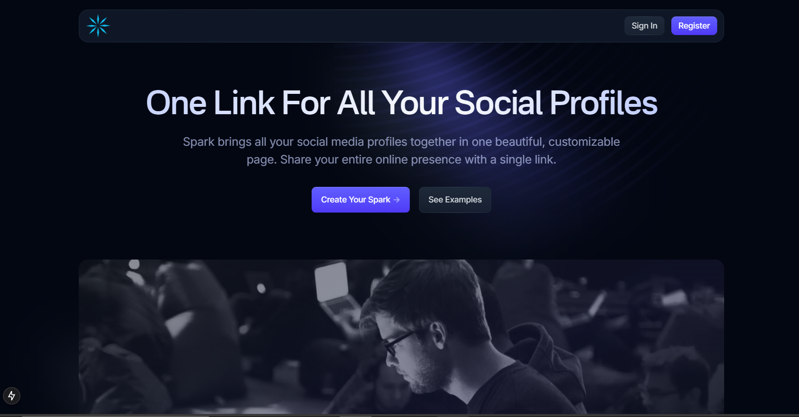

# Spark - Social Media Link Aggregator

<p align="center">
  
</p>
**Spark** is a modern web platform designed to consolidate and share social media links in a single, user-friendly profile. Similar to Linktree, Spark allows users to aggregate various social media handles, such as LinkedIn, Instagram, Snapchat, Twitter, and TikTok, into a unified link that can be easily shared.

## Project Overview

Spark provides individuals and businesses with a centralized platform to manage and share their online presence. Whether for personal branding or business marketing, Spark enhances accessibility and connectivity across the digital landscape.

### Key Features

- **Custom Profiles**: Create personalized profiles with customizable themes, fonts, and layouts
- **Social Integration**: Connect all your social platforms in one place - Instagram, Twitter, LinkedIn, TikTok, YouTube, and more
- **Analytics Dashboard**: Track profile visits, link clicks, and engagement metrics
- **Mobile Optimization**: Responsive design that looks perfect on any device
- **Custom Domain**: Use your own domain name for a professional touch
- **QR Code Generation**: Generate custom QR codes for your Spark profile

## Live Demo

Coming soon!

## Technology Stack

This project is built with:

- [Next.js](https://nextjs.org/) - React framework for server-rendered applications
- [Tailwind CSS](https://tailwindcss.com/) - Utility-first CSS framework
- [TypeScript](https://www.typescriptlang.org/) - Typed JavaScript

## Usage

This is a [Next.js](https://nextjs.org/) project bootstrapped with [`create-next-app`](https://github.com/vercel/next.js/tree/canary/packages/create-next-app).

### Getting Started

First, run the development server:

```bash
npm run dev
# or
pnpm dev (recommended)
# or
yarn dev
```

Open [http://localhost:3000](http://localhost:3000) with your browser to see the result.

You can start editing the page by modifying files in the `components` directory. The page auto-updates as you edit the files.

### Project Structure

- `/components` - React components used throughout the application
- `/public` - Static assets like images and icons
- `/app` - Next.js App Router pages and layouts
- `/utils` - Utility functions and helpers

## Roadmap

- User authentication system
- Profile management dashboard
- Link analytics and statistics
- Custom themes and templates
- Premium subscription features

## Deployment

The easiest way to deploy your Next.js app is to use the [Vercel Platform](https://vercel.com/new) from the creators of Next.js.

Check out the [Next.js deployment documentation](https://nextjs.org/docs/deployment) for more details.

## Credits

- Original template by [Cruip](https://cruip.com/)
- Modified for the Spark project

## License

This project is licensed under the [GPL](https://www.gnu.org/licenses/gpl-3.0.html).

## About Spark

Spark is designed to simplify your online presence by bringing all your social media profiles together in one beautiful, customizable page that you can share with a single link.
